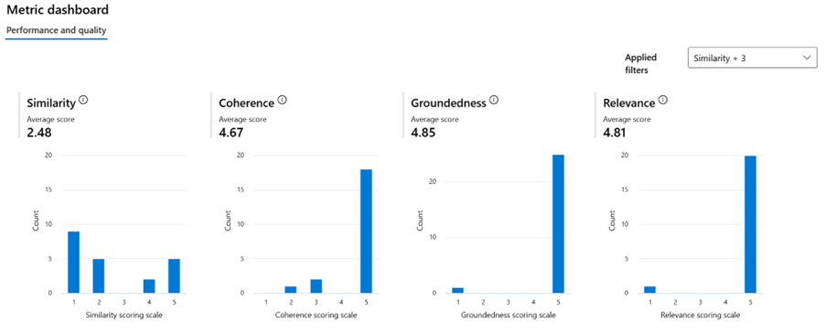

# 3. Chunk processing

## 3.1. Chunk documents

When implementing a RAG solution, it is important to make sure the documents are chunked in sub-documents with semantically relevant information, as well as keep a reasonable balance on the amount of information sent to the model to generate the final answer. If the sub-documents built from the documents are too small, they won’t provide enough information to generate a complete and correct answer, but if they are too long they will potentially introduce noise and irrelevant data in the answer built by the model. Semantic ranking further enhances this by ensuring each chunk is contextually meaningful, which improves the accuracy of the generated context. 

In any RAG implementation, is it necessary to test different strategies with the specific documents of the knowledge base and reference question and answer pairs to select the optimal chunking strategy for a specific scenario.

There are a few common strategies that we recommend testing:

- **Langchain Semantic Chunking:** splits the text based on semantic similarity.
- **GPT-4o Semantic Chunking:** splits the text based on semantic similarity and set in the same chunk every sentence in the document that are semantic similar.
- **Langchain with Tiktoken with a maximum of 512 tokens and 25% of overlapping:** split the text based on a maximum of 512 tokens with an overlapping of 25% of tokens between chunks. If the document has got 512 tokens or less the document is not chunked.
- **Langchain with Tiktoken with a maximum of 1024 tokens and 25% of overlapping:** split the text based on a maximum of 1.024 tokens with an overlapping of 25% of tokens between chunks. If the document has got 1024 tokens or less the document is not chunked.

After the chunking and indexing processes, a different search and answer generation tests has to be conducted, in order to **determine with chunking technique is the best** for the specific document type of the project.

### 3.1.1. References

The following are sample references for the recommended chunking strategies mentioned above. It is also possible to use an ad-hoc chunking strategy specific to the document collection, or based on logical sections of content, but specially for larger collections this can be difficult to scale.

#### 3.1. Langchain Semantic Chunking

Microsoft’s AI GBB RAG Multimodal Accelerator: [multimodal-rag-code-execution/tutorials/12_Semantic_Chunking.ipynb at main · Azure-Samples/multimodal-rag-code-execution · GitHub](https://github.com/Azure-Samples/multimodal-rag-code-execution/blob/main/tutorials/12_Semantic_Chunking.ipynb)

#### [3.1. Semantic Chunking with GPT-4o](./3.1.-Semantic-Chunking-with-GPT-4o/README.md)

Here are the [details](./3.1.-Semantic-Chunking-with-GPT-4o/README.md) and the code snippet.

#### [3.2. Chunking with Langchain and Tiktoken with a maximum of 512/1024 tokens and 25% of overlapping](./3.2.-Chunking-with-Langchain-with-max-tokens-and-overlapping/README.md)

Here are the [details](./3.2.-Chunking-with-Langchain-with-max-tokens-and-overlapping/README.md) and the code snippet.

## 3.2. Chunk enrichment

The standard flow in a RAG implementation is a user question to the system triggering a query in the knowledge base to retrieve the relevant information that will be then sent to the model to answer the user question. When this query is run, it contains not only the user question, but also specific filters based on additional metadata that help retrieve the right chunks from the index. For this to improve the search results it is important to define the right index structure and appropriate metadata for the chunks. Every chunk has to be enriched with metadata that will help Azure AI Search to retrieve the most pertinent content for the user’s query. The following is an example of an enriched chunk with different types of metadata:

There is not a fixed list of relevant metadata to include for every implementation, as it depends on the specific problem to solve as well as the type of information used in the solution. We typically recommend to have the chunk and its corresponding embeddings, as well as any additional fields that can act as a filter in the query to make the search results better.

**AS-IS:**

Specify current index fields configuration in Azure AI Search (if exists), identifying non-used fields:

For example:

| Field name | Comments | Searcheable | Used in the solution |
| --- | --- | --- | --- |
| DocumentID | Document ID from CMS | Yes/No | Yes/No |
| Title | Title of the document | Yes/No | Yes/No |
| Content | Main content of the document or section | Yes/No | Yes/No |
| Summary | Summary of the document | Yes/No | Yes/No |
| Keywords | Keywords about the document | Yes/No | Yes/No |
| DocumentType | Document type | Yes/No | Yes/No |
| FilterMetadata | Metadata that help to filter the search results by a business rule | Yes/No | Yes/No |
| StartDate | Date when the document starts to be retrieved by the search | Yes/No | Yes/No |
| EndDate | Date when the document ends to be retrieved by the search | Yes/No | Yes/No |
| embedding | Vector field with the embedded version of the content | Yes/No | Yes/No |

We recommend removing the fields that are part of the index but are not used for the search queries, to optimize the solution.

In general, for any indexation strategy, we recommend including only relevant fields for search or filtering and removing those that are not used. In many cases it can be useful as well to use dates to sort results and retrieve the most recent ones or leave the option for the final user of the platform to pick the dates or specific filters that they want the information to be based on.

Then, we can propose the list of metadata to enrich the chunks in the project, for example:

- **Title** **of the document**.
- **Keywords of the document:** this could be useful if the keywords are well prepared and are relevant to the content to help Azure AI Search to retrieve the associated content. The keywords could be improved using Azure AI Language service, that is able to extract automatically the key sentences from the documents to enrich the chunks:
- **Summary of the document**.
- **Questions** related to the document, defined manually by business users.
- **Filters field for user type**: The aim of search filters is to retrieve only the documents that are appropriate for the specific user. The project should find a technical way (likely with a rule engine easy to manage by business) to calculate the value for the type of user in a unique field, hiding the complexity of the rules and values, providing a more scalable and maintainable solution.
- **Filter fields relevant to a typical usecase flow. Eg. if typically the end user is only interestd in subset of documents based on hard criteria regardless of how relevant a document may sound from the semantic perspective. Those criteria can be such as documents date of creation or geographical location or specific device model for which the information is being retrived or any other key information that can render the document irrelevant entirely if not maching the search assumptions. Those key metadata should be indexed as separate fields in the index for the prefiltering process during the search.

## 3.3 Embed chunks and metadata

An embedding is a mathematical way to represent an object, such as a piece of text that effectively captures the object's meaning. It has become a fundamental component in RAG implementation, as it allows mathematical comparison between text using similarity and distance.

In a Retrieval-Augmented Generation (RAG) solution, you typically use the same embedding model to process the user query as you did for your chunks. This allows you to search for the most relevant vectors in your database, returning the chunks that are most semantically similar. The original text of these relevant chunks is then given to the large language model as background information.

When selecting an embedding model, you need to balance performance and cost. Larger embedding models generally perform better on benchmark datasets, but they come with higher costs. These models produce larger vectors that need more storage space in a vector database and require more computational resources and time for comparing embeddings. On the other hand, smaller embedding models tend to have lower performance on the same benchmarks but are more cost-effective. They need less storage space and require less computational power and time for embedding comparisons. For the past year and a half the standard embeddings model has been Azure Open AI text-embeddings-ada-002, which provides really good results overall for different types of information. However, there were additional embeddings models published recently that might be good to consider if there was a need to improve this specific part of the solution.

For our assessment, we have conducted test with two Azure OpenAI embedding models: text-embedding-ada-002 (1536 dimensions) and text-embedding-3-large (3072 dimensions) and the search results with B2C content (the only one that we have the appropriate search filters) are very similar, so in this case model text-embedding-ada-002 is a good selection.

We also have to test several approaches of embedding fields:

- One embedding field created with ada-02 and with large-03, from the chunk content vectorized.
- One embedding field created with ada-02 and with large-03, from the title and chunk content.
- Two embedding fields created with ada-02 and with large-03: one with the title and another one with chunk content.
- Three embedding fields created with ada-02 and with large-03, from: one field with the title, other with the chunk content and another one with the rest of searcheable fields (keywords, summary, etc.)
