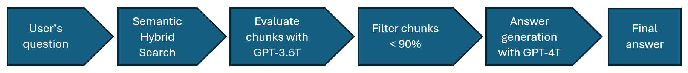

## 4.1. Search results re-ranking

Reranking search results reranking is a good technique to improve the performance and the quality of the answers generated by the model. It is also relevant from an optimization perspective, as it can be implemented using a lighter and cheaper model, and then sending a shorter prompt to the more powerful and costly model to build the final answer.

This technique involves retrieving more documents than the traditional RAG (that usually retrieves 10 documents) in the retrieval step and then iterating though them with GPT-3.5 Turbo to see if they answer the user’s question. The document is then scored based on this relevance and the relevant parts are extracted. The extracts and scores are then sorted, and the top ten chunks are used to augment the prompt in the traditional RAG method. Only the chunks with a confidence of 90% or more are used in the final prompt to generate the answer. The chunks evaluation has to be executed in parallel in a multi-thread process, so in total it will takes as long the slower call to GPT-3.5T.

The re-ranker process is as follows:

These are the prompts for analyzing every retrieved chunk (replace “telecommunications” for the client’s sector):

**System prompt:** _"You are an assistant that returns content relevant to a search query from an telecommunications company agent serving customers._
_Return the content needed to understand the context of the answer and only what is relevant to the search query in a field called "answer". Include every relevant detail from the text to ensure all pertinent information is retained._

_In your response, include a percentage between 0 and 100 in a "confidence" field indicating how confident you are the answer provided includes content relevant to the search query._

_If the user asked a question, your confidence score should be based on how confident you are that it answered the question. Answer ONLY from the information listed in the text below._

_Respond in JSON format as follows, for instance:_

_{_
_"confidence": 100,_
_"answer": "Our company offers a range of telecommunication products for home customers."_
_}"_

**User prompt:** "Search Query: \[question\]. Text: \[text\]"

**Code Snippets:**
First create the Azure AI Search index and sample index documents created: [create_index_and_index_documents.ipynb](../4.1.-create-index-and-index-documents/create_index_and_index_documents.ipynb)

and then re-rank chunks retrieved in the search and generate answers: [rerank_chunks_and_generate_answer.ipynb](./rerank_chunks_and_generate_answer.ipynb)
