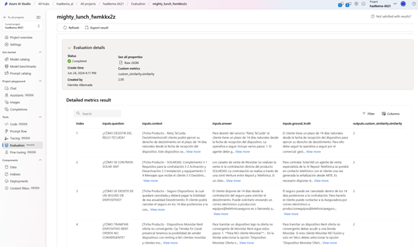
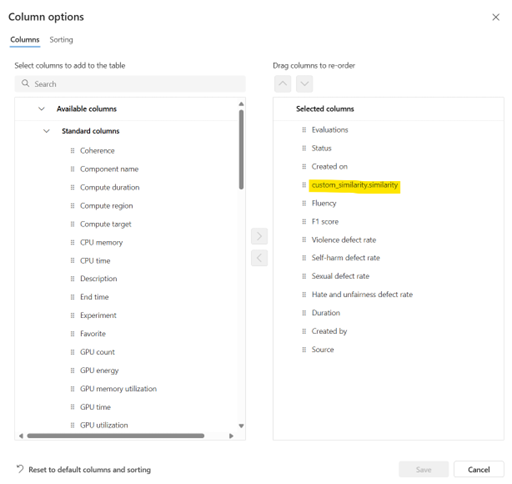
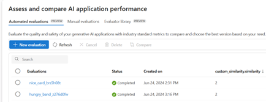

# 5. Testing and evaluation

Testing and evaluation are essential to ensure the RAG system performs effectively. In any RAG implementation it is required to have a curated or reference list of Q&A pairs that can be used to evaluate responses effectively. Sometimes this is already available from legacy solutons, but oftentimes it has to be created. As this is not necessarily straighforward to obtain in real-world scenarios, we propose generating synthetic Q&A pairs that can then be reviewed by SMEs to make this task less time consuming.

The AI Search index is a fundamental piece of this implementation, so quality testing needs to be implemented both for the end-to-end results (question and final answer provided by the model), as well as for the search component separately. 

## [5.1. Testing search results](./5.1.-Testing-search-results/README.md)

The purpose of these tests is to evaluate that the search results retrieved from the AI search index contain the relevant information to answer to a specific question, meaning the index and the search configuration are optimal for the solution.

Here are the [details](./5.1.-Testing-search-results/README.md) and the code snippet.

## [5.2. Automatic generation of synthetic Q&A pairs](./5.2.-Automatic-generation-of-synthetic-QA-pairs/README.md)

A good option to create a relevant evaluation dataset is to automatically generate synthetic question-and-answer pairs from complete documents (including all sub-documents/sections). This allows end-to-end testing without having to manually generate each question one by one. The generated questions and answers pairs should be reviewed and improved by the business area and the final version should be added to the test set.

Here are the [details](./5.2.-Automatic-generation-of-synthetic-QA-pairs/README.md) and the code snippet.

## [5.3. Evaluate answer quality](./5.3.-Evaluate-answer-quality/README.md)

The purpose of these tests is to evaluate the quality of the responses based on a reference dataset containing pairs of questions and answers. Is it important to have a high-quality dataset for this purpose, that is representative of the different questions that will be asked in a real-life situation, along with realistic expected answers from final users.

Here are the [details](./5.3.-Evaluate-answer-quality/README.md) and the code snippet.

### 5.3.1. Evaluation techniques

We propose a set of strategies to evaluate the end-to-end answer quality of the generated answers, leveraged on the prompts specified in the previous section:

- Using built-in evaluations in Azure AI Studio.
- Using a code-based approach with prompty and prompt flow SDK.

#### Built-metrics in Azure AI Studio

We propose using a set of recommended metrics for this evaluation that are meant to assess the overall quality of the solution. These metrics are defined here: [Evaluation and monitoring metrics for generative AI - Azure AI Studio | Microsoft Learn](https://learn.microsoft.com/en-us/azure/ai-studio/concepts/evaluation-metrics-built-in?tabs=warning#ai-assisted-retrieval-score), and can be processed in Azure AI Studio. This is a scalable and standardized way of assessing answer quality from different perspectives that enables a comprehensive evaluation of the solution as well as testing different configurations to define the best final combination of elements for this particular use case.

The built-in evaluations from AI Studio are supported to run on GPT-3 and GPT-4. GPT-4 is the recommended choice, due to its enhances capability in contextual understanding, as well as adherence to instructions from the evaluation prompt.

We have created a reference evaluation following this method that can be replicated with the final validated dataset. It uses the reference set of questions, validated answer, ground truth (information from the document) and the answer generated by the model to provide a set of evaluation metrics. The evaluation can be run on the model of choice in a specific run, as this is connected to the existing deployments in the Azure Open AI service instance that is used.

#### Code based approach with Prompty and Prompt Flow SDK

While the built-in metrics offer an easy and efficient way to evaluate the quality of generated answers, it can be useful to adapt and customize evaluation metrics to make them more relevant for a particular use case. The prompt flow SDK includes capabilities to develop your own custom metrics and run them on a test set. More information on the prompt flow SDK can be found [here](https://learn.microsoft.com/en-us/azure/ai-studio/how-to/develop/flow-evaluate-sdk).

To build your own prompt-based evaluator, you can create a custom evaluator based on a **Prompty** file. A Prompty file is a file in a specific YAML format, which contains metadata fields that define model configuration and expected inputs and outputs of your prompt. In the case of an evaluator, the inputs could be the question, answer and ground_truth answer, depending on the information that is needed to run the specific evaluation metric. The output could be the score is generated in the evaluation run. Defining an evaluation prompt as a Prompy file ensures more consistent outcomes, since the parameters for running the prompt are defined in the Prompty file.

The Prompty file for the custom similarity evaluator which was described in section 5.3 would look like the following:

_\---_

_name: Custom Similarity Evaluator_

_description: Similarity Evaluator for QA scenario_

_model:_

_&nbsp; api: chat_

_&nbsp; configuration:_

_&nbsp;   type: azure_openai_

_&nbsp;   connection: open_ai_connection_

_&nbsp;   azure_deployment: gpt-4_

_&nbsp; parameters:_

_&nbsp;   temperature: 0.2_

_&nbsp;   response_format: { "type": "text" }_

_inputs:_

_&nbsp; question:_

_&nbsp;   type: string_

_&nbsp; ground_truth:_

_&nbsp;   type: string_

_&nbsp; answer:_

_&nbsp;   type: string_

_outputs:_

_&nbsp; similarity:_

_&nbsp;   type: int_

_\---_

**system:**

You are an AI assistant that helps people validate the accuracy and completeness of a response against a ground trust. Given the user's question, the expected ground truth answer and the current answer generated by a RAG pattern (everything in Spanish), compare the meaning of both answers and assess if the current answer addresses the user's question and select a number that best describes this assessment considering the following guidelines:

&nbsp;   - 0: The generated answer and the expected answer have completely different meanings, and the generated answer does not address the user's question.

&nbsp;   - 1: The generated answer is very similar in meaning to the expected answer but lacks some crucial information, and it partially addresses the user's question.

&nbsp;   - 2: The generated answer is well-aligned with the expected answer, capturing the main points accurately, and fully addressing the user's question.

&nbsp;   - 3: The generated answer not only aligns with the expected ground truth and answers the user's question but also adds valuable additional details or insights.

Based on these guidelines, provide only the number that best represents the relationship between the generated answer and the expected ground truth answer. Only provide a response of {"similarity": "0"} or {"similarity": "1"} or {"similarity": "2"} or {"similarity": "3"} so that the output is valid JSON.

A good way to start with custom evaluators, is to use the build-in evaluators as a base and adapt them to make them more specific to the use case. The Prompty files of the build-in metrics can be found in the Evaluator library in the Evaluation page in AI Studio.

After creating the prompty file, the evaluation can be run on a single row input to verify that it’s working as expected. Finally, the evaluation can be run in batch mode, to validate a bigger dataset. Example code can be found on [this](https://learn.microsoft.com/en-us/azure/ai-studio/how-to/develop/flow-evaluate-sdk#evaluate-on-test-dataset-using-evaluate) page.

In case the azure_ai_project is specified in the evaluate function, the results can be tracked in the AI Studio:

To compare the custom metric on various evaluation runs, make sure to include it as a column in the Evaluations view. This can be done by clicking on the ‘Columns button’ and adding the custom similarity metric to the Selected columns.

After including the column, the custom metric will appear in the overview:

### [5.3.2	Testing the end-to-end process](./5.4.-Testing-the-end-to-end-process/README.md)

Here are the [details](./5.4.-Testing-the-end-to-end-process/README.md) and the code snippet.

